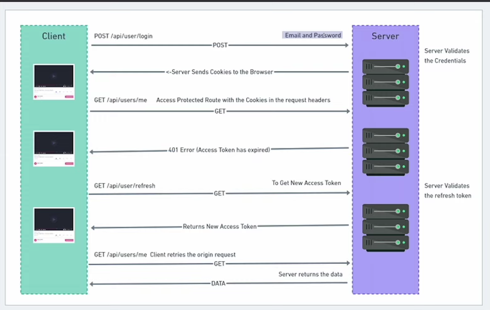

# ELearner

## Development Roadmap

Welcome to ELearner This README provides a comprehensive guide to understanding the development process, features, technologies, and how to get started.

## Features

- **Authentication**
- **Layout**
- **Courses**
- **Analytics**
- **Order**
- **Notifications**

## Development Sequence

1. **UI Development**: Craft an engaging and user-friendly UI as the foundation for an exceptional user experience.

2. **Application Breakdown**: Analyze and categorize the application into main features and minor features, setting the stage for development.

3. **Feature Counting**: Enumerate the main features listed above to clearly define the scope of the project.

## Technology Selection

### Three-Part Application Division

- **Low Traffic Areas (Next.js)**

  - Ideal for sections with lower user visitation.

- **Medium Traffic Areas (Django)**

  - Tailored for areas with intricate features and frequent user interactions.

- **High Traffic Areas**
  - 

### Project Technology Stack

- **Frontend**: [Next.js](https://nextjs.org/)
- **Backend**: [Node.js](https://nodejs.org/)
- **Caching (Redis)**:

  - **Importance of Cache Maintenance**:
    - Efficient handling of large data in the website cache.
    - Employed during high API request volumes, optimizing response times for up to 1000 concurrent user requests.
    - Implementation of both backend and frontend caches.
    - Redis, functioning as a versatile database akin to MongoDB, alleviates server pressure during peak user visits.
    - Two cache types: frontend cache for commonly accessed data and backend cache for optimizing data retrieval.

- **RTK Query**: ?

- **CSS Framework**: [Tailwind CSS](https://tailwindcss.com/)
- **Dynamic Templates (E.js)**: Used for sending dynamic templates to users, enhancing overall user experience.

## Redis Caching in Detail

Caching is a crucial aspect of ELearner, particularly managed by Redis. Redis serves as an efficient, in-memory data store that significantly enhances application performance. Key aspects of Redis integration include:

In a typical web application architecture, Redis might be used for various purposes on the server-side, like caching session data, managing distributed locks, or storing temporary data. Meanwhile, cookies are used on the client-side to store information that needs to persist between different requests from the same user.

For example, you might use Redis to store a session ID on the server, and then that session ID could be stored in a cookie on the client-side. The server can then use the session ID from the cookie to retrieve session data stored in Redis.

To sum up, Redis and cookies serve different purposes in a web application, with Redis being a server-side storage solution and cookies being a client-side storage mechanism.

- **Handling Large Data**: Redis efficiently manages extensive datasets within the website cache, ensuring rapid data retrieval.

- **Optimizing API Requests**: During peak loads, Redis plays a pivotal role in handling a substantial volume of API requests, maintaining a seamless user experience.

- **Frontend and Backend Caching**: Implementation of both frontend and backend caching mechanisms ensures that frequently accessed data is readily available, reducing the need for repeated database queries.

- **Versatility as a Database**: Redis functions as a flexible and high-performance database, operating similar to MongoDB but with the added benefit of in-memory caching.

## Staring with Backend 

###  Creating server
  - npm init
  - npm i bcryptjs cookie-parser cors dotenv express ioredis jsonwebtoken mongoose ts-node-dev @types/bcryptjs @types/cookie-parser @types/cors @types/jsonwebtoken @types/express @types/node typescript

  - create app.ts
     - import express

  - create server.ts
      - create dotenv
          "dev":"ts-node-dev --respawn --transpile server.ts"
          // add this in package.json
          - it shows error  then use this 
            //  "dev": "ts-node-dev --respawn --transpile-only --compiler-options \"{\\\"module\\\": \\\"CommonJS\\\", \\\"moduleResolution\\\": \\\"Node\\\"}\" server.ts"
          - npm run dev
  # Conneting databse
    - to go upstash
        - upstash is used to connect redis
        - mongodb
        - cloudinary

  # Error Handling
    - create errorhandle file 
    - write all error messages
    - in error.ts file we write custom errors for every error
    - in CatchAsyncError file we handerl asynchronous errors
    
# user Model is creater
  - create user model

# controllers
  - creating controller
  - installing necessary libraries
     - npm i ejs 
     - npm i nodemailer ( it is use to send mail)
      - npm i --save-dev @types/ejs
      -npm i --save-dev @types/nodemailer
#

# Authentication 

  - create mail template
  - now goto google -> security -> search app password -> give name nodemailer -> it generate one password
  - create registrationUser function 
      - take input from body
      - check it exist in our databse 
      - create user 
      - cerate activation function token
      - now send the mail with ejs template 
          - to send sendMail enbuilt function
  - Now activate our user
    - our function take two aurguments 
        - activation code from mail and activation_token from local storage with our activation secret 
        - first decode the token using jwt verfy with activation secret
        - now compare the users activation code with activation_code from mail 
        - now check user is exist in our databse if exist give error
        - NOW CREATE USER 
      

  => login api
      -  when user hit the login api then server check or validate the email and password with existing data in database
      - after checking server send cooke to the browser access toke exire after  min Refresh token expire after long time 
      - whenever we refresh the page we hit api refresh to generate new token 

